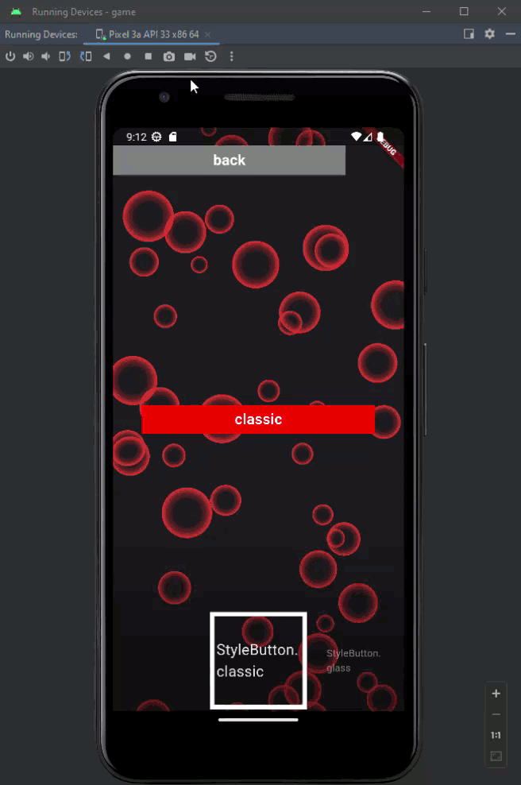
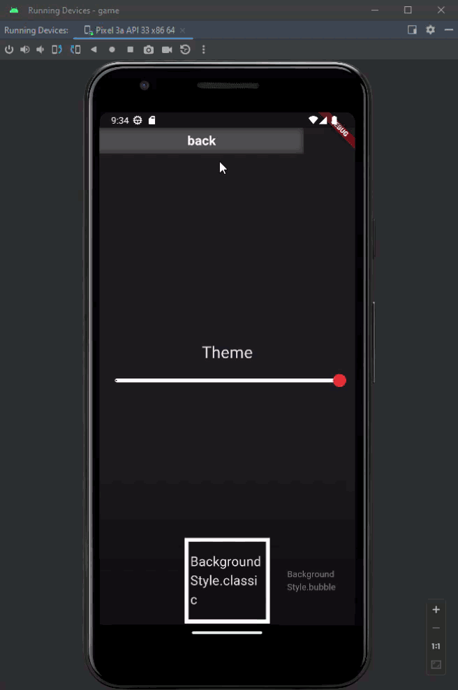
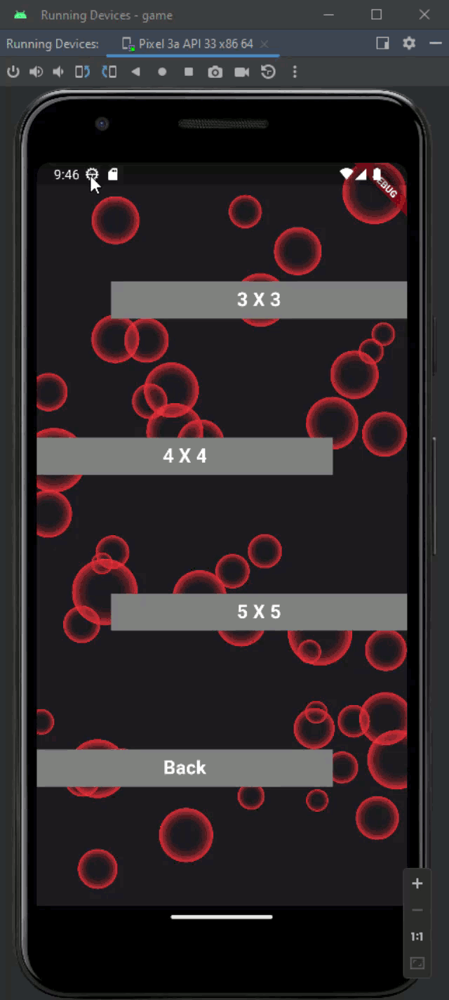

# Tap Tap Tile

Tap Tap Tile is a personal project. It's a small app game for Android, developped with Flutter and Dart only (no Flame).
The application use Bloc as a state manager and Sqflite regarding the Database.

## Rules
Tiles spawn at the top of the screen and fall off. The goal is to click on tiles before they reach the bottom of the screen.
Each time a tile is clicked, the score increases.
If a tile reaches the bottom of the screen or if a click is made outside a tile, then the game is over.

3 Difficulties are available : 3, 4 and 5 tiles.
For each difficulty, the 5 best scores are stored in the Database.

## Customisation
	The application offers a wide variety of customization options, such as : 
		Changing the tile's color
		changing the button's color
		Changing the button's style : Classic, Glass and Neon
		Changing button font color
		Changing application theme : light or Dark
		Activating or desactivating an animated background : Empty, Bubble and Crystal  

## About the animated background
The animated background is mainly inspired by the flutter_animated_background package, I modified some part based on my needs.

All credits goes to this package. https://pub.dev/packages/animated_background

## Visuals

