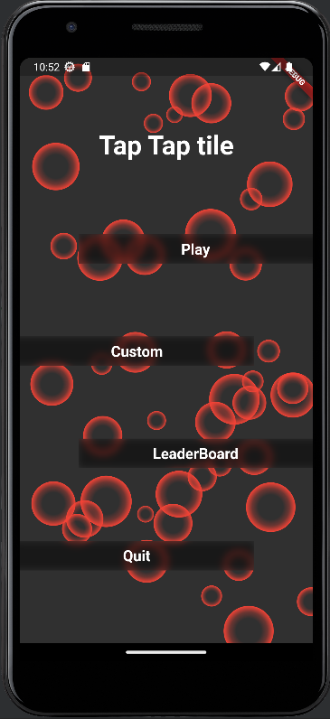

# Tap tap tile

Flutter mobile game (Android)

Tap tap tile is a small (prototype) game for android devices, the goal is to tap a maximum of tiles to get the best score.

## Details

    3 modes available : 3x3, 4x4 , 5x5.
    Many custom options available :
	    Change tile color
	    Change button appearance: opaque and glass
	    Active animated background : Empty, Bubble, crystal
	    Leaderboard : a database store 5 per difficulty
	    Option : database stores current options set

## About the animated background
The animated background is mainly inspired by the flutter_animated_background package, all credits goes to this package.
https://pub.dev/packages/animated_background
